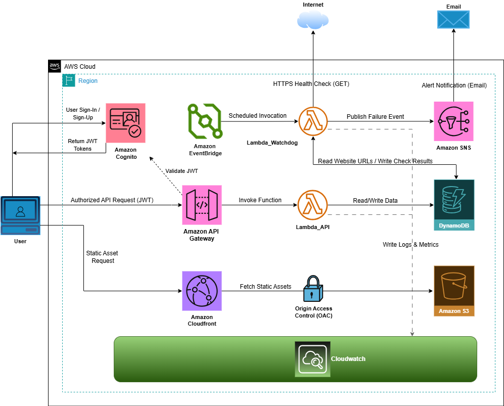

> Final Degree Project developed by Pablo García-Rojo.

# Serverless Watchdog

Serverless Watchdog is a cloud-native monitoring platform that checks the availability and latency of registered websites and exposes the results through a protected web dashboard.

The application is built with a fully serverless architecture on AWS. It uses a React frontend distributed through Amazon CloudFront, an API Gateway REST API protected with Amazon Cognito, AWS Lambda for compute, DynamoDB for persistence, EventBridge for scheduled checks, and SNS for email alerts.

---

## Table of Contents

- [Overview](#overview)
- [Features](#features)
- [Architecture](#architecture)
- [Technology Stack](#technology-stack)
- [AWS Services](#aws-services)
- [Repository Structure](#repository-structure)
- [Authentication Flow](#authentication-flow)
- [API Endpoints](#api-endpoints)
- [Prerequisites](#prerequisites)
- [Local Development](#local-development)
- [Infrastructure Deployment](#infrastructure-deployment)
- [Frontend Deployment](#frontend-deployment)
- [Environment Variables](#environment-variables)
- [Cognito User Registration](#cognito-user-registration)
- [Useful Commands](#useful-commands)
- [Security Notes](#security-notes)
- [Troubleshooting](#troubleshooting)
- [Roadmap](#roadmap)

---

## Overview

Serverless Watchdog allows authenticated users to manage a list of monitored websites, view uptime logs, inspect latency metrics, and receive alerts when a monitored endpoint is detected as unavailable.

The project was designed as a serverless AWS application where infrastructure is provisioned with Terraform and the frontend is deployed as a static single-page application.

---

## Features

- User authentication with Amazon Cognito.
- Custom React login, registration, and account confirmation flow.
- Protected API Gateway routes using a Cognito User Pool Authorizer.
- Website inventory management:
  - Add monitored websites.
  - Delete monitored websites.
  - List monitored websites.
- Scheduled website health checks with EventBridge and Lambda.
- DynamoDB persistence for:
  - Website inventory.
  - Historical monitoring logs.
- Dashboard KPIs:
  - Number of monitored URLs.
  - Lambda execution interval.
  - Active alerts.
- Latency chart using Recharts.
- Logs page with incident filtering.
- Email alerting through Amazon SNS.
- CloudFront distribution for frontend delivery.
- Infrastructure as Code with Terraform.

---

## Architecture

The diagram below summarizes the AWS serverless architecture used by the project:

<p align="center">
  
</p>

The simplified runtime flow is:

```text
User
  |
  v
Amazon CloudFront
  |
  v
S3 Static Website / React SPA
  |
  | Cognito login, sign up, token handling
  v
Amazon Cognito User Pool
  |
  | Authorization: Bearer <JWT>
  v
Amazon API Gateway REST API
  |
  | Cognito User Pool Authorizer
  v
Lambda API Backend
  |
  +--> DynamoDB Inventory Table
  |
  +--> DynamoDB Logs Table


Amazon EventBridge
  |
  v
Watchdog Lambda
  |
  +--> Reads monitored websites from DynamoDB
  |
  +--> Performs HTTP checks
  |
  +--> Stores health logs in DynamoDB
  |
  +--> Sends alerts through SNS
```

---

## Technology Stack

### Frontend

- React
- Vite
- JavaScript
- Tailwind CSS
- React Router
- Axios
- AWS Amplify Auth
- Recharts

### Backend

- Python
- AWS Lambda
- Boto3
- API Gateway Lambda Proxy Integration

### Infrastructure

- Terraform
- AWS CLI

---

## AWS Services

| Service | Purpose |
|---|---|
| Amazon S3 | Hosts the static React build files |
| Amazon CloudFront | CDN distribution for the frontend |
| Amazon Cognito | User authentication and JWT issuance |
| Amazon API Gateway | Public REST API entrypoint |
| API Gateway Cognito Authorizer | Validates Cognito JWT tokens before invoking Lambda |
| AWS Lambda | Serverless compute for API and scheduled monitoring |
| Amazon DynamoDB | Stores website inventory and monitoring logs |
| Amazon EventBridge | Triggers the watchdog Lambda on a schedule |
| Amazon SNS | Sends email alerts when a website is down |
| AWS IAM | Manages permissions between AWS services |

---

## Repository Structure

```text
watchdog-aws/
├── docs/
│   └── architecture.png
│
├── frontend/
│   ├── public/
│   ├── src/
│   │   ├── assets/
│   │   ├── components/
│   │   │   ├── Dashboard.jsx
│   │   │   ├── Login.jsx
│   │   │   ├── Logs.jsx
│   │   │   └── ProtectedRoute.jsx
│   │   ├── apiClient.js
│   │   ├── awsAuth.js
│   │   ├── App.jsx
│   │   ├── index.css
│   │   └── main.jsx
│   ├── .env.example
│   ├── eslint.config.js
│   ├── index.html
│   ├── package.json
│   ├── package-lock.json
│   └── vite.config.js
│
├── src/
│   ├── api_backend.py
│   └── watchdog.py
│
├── terraform/
│   ├── apigateway.tf
│   ├── cognito.tf
│   ├── cloudfront.tf
│   ├── dynamodb.tf
│   ├── eventbridge.tf
│   ├── iam.tf
│   ├── lambda.tf
│   ├── main.tf
│   ├── outputs.tf
│   ├── s3.tf
│   ├── sns.tf
│   └── variables.tf
│
├── .gitignore
└── README.md
```

---

## Authentication Flow

The application uses a custom React authentication UI backed by Amazon Cognito.

1. The user opens the React application through CloudFront.
2. The user creates an account or logs in from the custom `Login.jsx` page.
3. AWS Amplify Auth communicates with Cognito.
4. Cognito returns JWT tokens after successful authentication.
5. The frontend uses an Axios interceptor in `apiClient.js` to attach the token to every API request:

```http
Authorization: Bearer <id_token>
```

6. API Gateway validates the token using a Cognito User Pool Authorizer.
7. If the token is valid, API Gateway invokes the backend Lambda.
8. If the token is missing or invalid, API Gateway returns `401 Unauthorized`.

The API `OPTIONS` methods are intentionally left unauthenticated to allow browser CORS preflight requests.

---

## API Endpoints

| Method | Path | Authentication | Description |
|---|---|---|---|
| `GET` | `/webs` | Cognito | List monitored websites |
| `POST` | `/webs` | Cognito | Add a new website |
| `DELETE` | `/webs?url=<url>` | Cognito | Delete a monitored website |
| `GET` | `/logs` | Cognito | Retrieve monitoring logs |
| `GET` | `/logs?health_status=ERROR` | Cognito | Retrieve failed checks |
| `GET` | `/interval` | Cognito | Retrieve the watchdog interval |
| `OPTIONS` | `/*` | Public | CORS preflight |

---

## Prerequisites

Install the following tools before deploying the project:

- Node.js and npm
- Terraform
- AWS CLI
- Python 3
- An AWS account with permissions to create:
  - S3 buckets
  - CloudFront distributions
  - Lambda functions
  - API Gateway resources
  - DynamoDB tables
  - Cognito User Pools
  - EventBridge rules
  - SNS topics
  - IAM roles and policies

Configure AWS credentials:

```bash
aws configure
```

Or use an AWS profile:

```bash
export AWS_PROFILE=<your-profile>
```

On Windows PowerShell:

```powershell
$env:AWS_PROFILE="<your-profile>"
```

---

## Local Development

Go to the frontend application:

```bash
cd frontend
```

Install dependencies:

```bash
npm install
```

Create a local environment file:

```bash
cp .env.example .env
```

Edit `frontend/.env` with your deployed AWS values:

```env
VITE_API_URL=https://your-api-id.execute-api.eu-south-2.amazonaws.com/prod
VITE_COGNITO_USER_POOL_ID=eu-south-2_xxxxxxxxx
VITE_COGNITO_USER_POOL_CLIENT_ID=xxxxxxxxxxxxxxxxxxxxxxxxxx
```

Run the development server:

```bash
npm run dev
```

The application will usually be available at:

```text
http://localhost:5173
```

---

## Infrastructure Deployment

Go to the Terraform directory:

```bash
cd terraform
```

Initialize Terraform:

```bash
terraform init
```

Format and validate the configuration:

```bash
terraform fmt
terraform validate
```

Review the execution plan:

```bash
terraform plan
```

Apply the infrastructure:

```bash
terraform apply
```

After deployment, inspect the outputs:

```bash
terraform output
```

Typical outputs include:

```text
api_gateway_url
cloudfront_distribution_domain_name
cognito_user_pool_id
cognito_user_pool_client_id
```

Use these values to configure the frontend `.env` file before building the React app.

---

## Frontend Deployment

From the `frontend/` directory, build the production frontend:

```bash
npm run build
```

Upload the generated files to the S3 frontend bucket:

```bash
aws s3 sync dist/ s3://<your-frontend-bucket-name> --delete
```

Invalidate CloudFront cache so users receive the latest version:

```bash
aws cloudfront create-invalidation \
  --distribution-id <your-cloudfront-distribution-id> \
  --paths "/*"
```

Then open the CloudFront distribution URL in your browser.

---

## Environment Variables

### Frontend

Create `frontend/.env` from `frontend/.env.example`.

```env
VITE_API_URL=https://your-api-id.execute-api.eu-south-2.amazonaws.com/prod
VITE_COGNITO_USER_POOL_ID=eu-south-2_xxxxxxxxx
VITE_COGNITO_USER_POOL_CLIENT_ID=xxxxxxxxxxxxxxxxxxxxxxxxxx
```

Vite only exposes variables prefixed with `VITE_` to the frontend application.

### Backend Lambda

The backend Lambda uses environment variables configured through Terraform.

Typical values include:

```text
TABLE_INVENTORY=<inventory-table-name>
TABLE_LOGS=<logs-table-name>
FRONTEND_URL=https://your-cloudfront-domain
WATCHDOG_INTERVAL=<interval-in-minutes>
SNS_TOPIC_ARN=<sns-topic-arn>
```

---

## Cognito User Registration

The frontend includes:

- Login
- Account creation
- Email confirmation
- Logout
- Protected routes

Users can register from the application UI. After registration, Cognito sends a confirmation code to the user's email address. The account must be confirmed before login.

For manual testing, users can also be created with the AWS CLI:

```bash
aws cognito-idp admin-create-user \
  --user-pool-id <user-pool-id> \
  --username user@example.com \
  --user-attributes Name=email,Value=user@example.com Name=email_verified,Value=true \
  --message-action SUPPRESS
```

Set a permanent password:

```bash
aws cognito-idp admin-set-user-password \
  --user-pool-id <user-pool-id> \
  --username user@example.com \
  --password 'Password123!' \
  --permanent
```

---

## Useful Commands

### Check if the production build contains the latest frontend changes

```bash
grep -R "Create account" dist/assets || true
grep -R "aws-amplify" dist/assets || true
```

### Test that protected API routes reject unauthenticated requests

```bash
curl -i https://your-api-id.execute-api.eu-south-2.amazonaws.com/prod/webs
```

Expected result:

```text
401 Unauthorized
```

### Test CORS preflight

```bash
curl -i -X OPTIONS https://your-api-id.execute-api.eu-south-2.amazonaws.com/prod/webs
```

Expected result:

```text
200 OK
```

### List CloudFront distributions

```bash
aws cloudfront list-distributions \
  --query "DistributionList.Items[*].[Id,DomainName,Origins.Items[0].DomainName]" \
  --output table
```

---

## Security Notes

Do not commit sensitive or generated files.

The repository `.gitignore` should exclude:

```gitignore
node_modules/
frontend/node_modules/
dist/
frontend/dist/
.env
frontend/.env
terraform.tfstate
terraform.tfstate.*
*.tfvars
.terraform/
*.zip
```

Files that should be committed:

```text
frontend/package.json
frontend/package-lock.json
frontend/.env.example
frontend/src/
terraform/*.tf
src/*.py
```

Important security considerations:

- Never commit real `.env` files.
- Never commit `terraform.tfstate`; it can contain sensitive infrastructure information.
- The Cognito App Client used by the React app must not have a client secret.
- API Gateway should protect business endpoints with Cognito.
- `OPTIONS` methods should remain public for CORS preflight requests.
- CloudFront cache should be invalidated after each frontend deployment.
- In a multi-user production system, DynamoDB keys should be redesigned to isolate user data by Cognito `sub`.

---

## Troubleshooting

### API requests fail with CORS errors

Verify that Lambda/API Gateway returns:

```http
Access-Control-Allow-Origin: https://your-cloudfront-domain
Access-Control-Allow-Headers: Content-Type,Authorization
Access-Control-Allow-Methods: OPTIONS,POST,GET,DELETE
```

Also verify that `OPTIONS` methods are not protected by Cognito.

---

### API Gateway returns 401 after login

Check the browser DevTools Network tab and verify that requests contain:

```http
Authorization: Bearer <token>
```

If the header is missing, check:

- `frontend/src/awsAuth.js`
- `frontend/src/apiClient.js`
- `frontend/src/main.jsx`
- Calls in `Dashboard.jsx` and `Logs.jsx` must use `api`, not raw `axios`.

---

### Cognito registration succeeds but login fails

The user may not be confirmed yet. Confirm the account using the code sent by email, or verify the user manually in the Cognito console.

---

## Roadmap

Potential future improvements:

- Send alerts directly to each authenticated user's email address.
- Migrate the monitoring component to a multi-region architecture to reduce false positives caused by local network or regional connectivity issues.
- Redesign DynamoDB keys for full multi-user isolation.
- Add password reset flow.
- Add user profile management.
- Add custom domains for CloudFront and API Gateway.
- Add CI/CD with GitHub Actions.
- Add automated tests for frontend and Lambda code.


---

## License

Copyright © 2026 Pablo García-Rojo.

All rights reserved.

This project is provided for educational and portfolio purposes only. No permission is granted to copy, modify, distribute, sublicense, or use this software for commercial purposes without prior written permission from the author.
